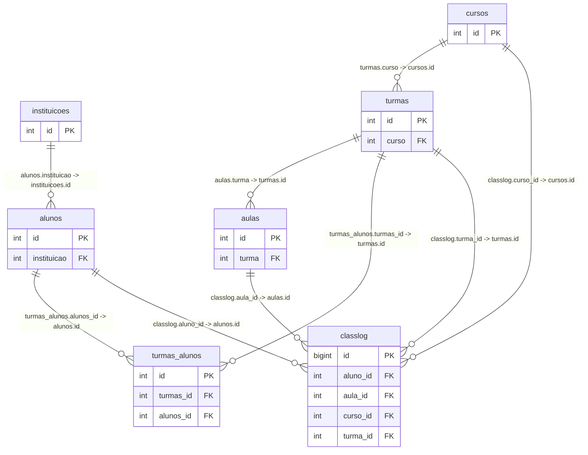
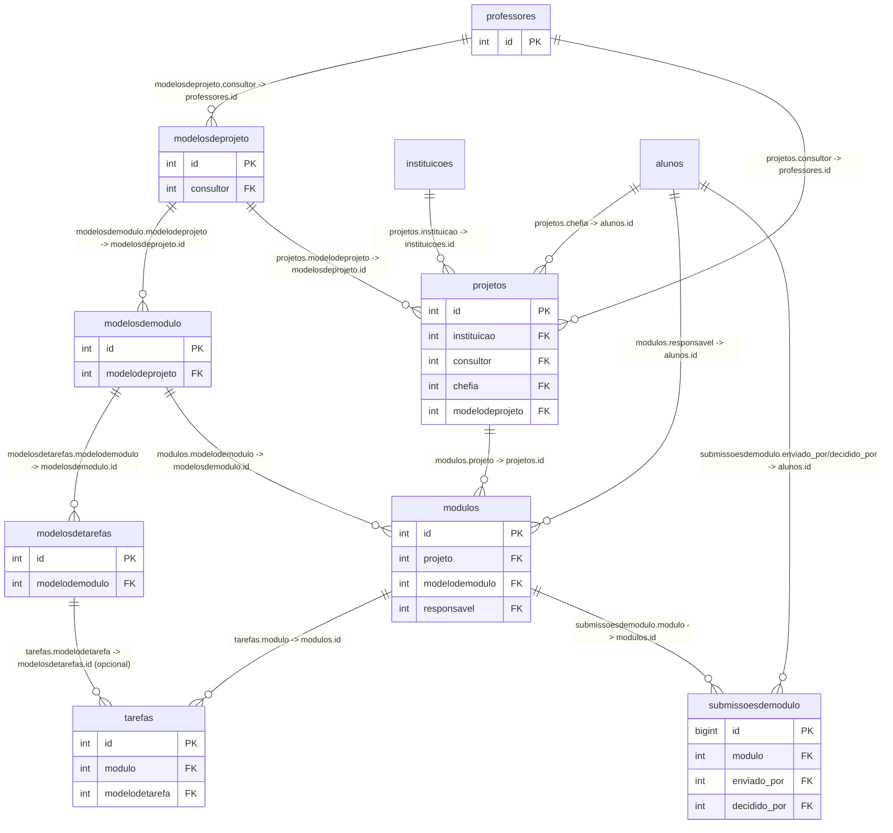
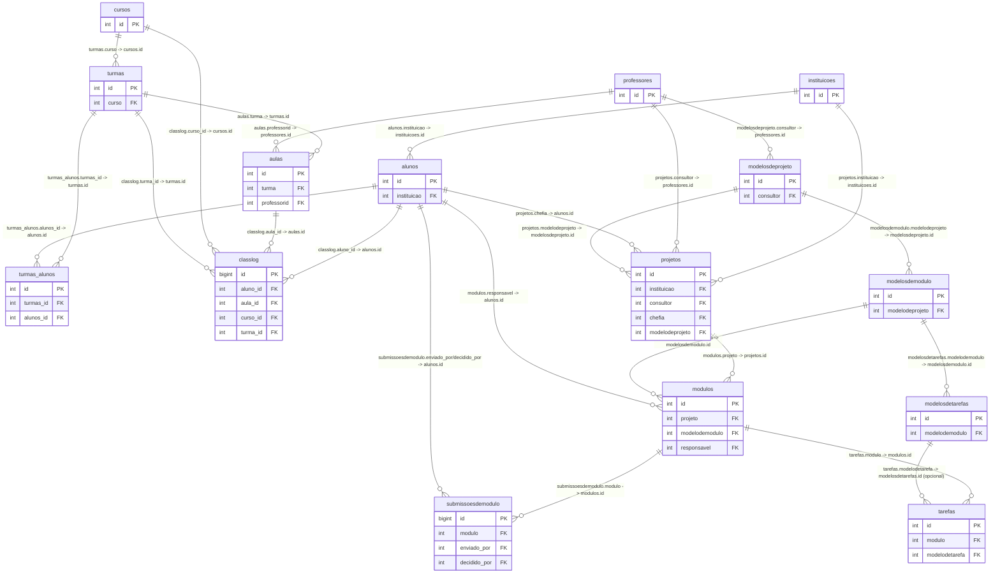
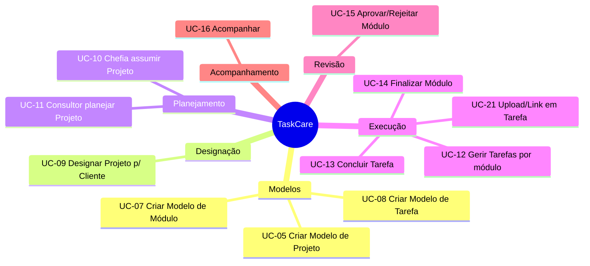

# TaskCare — Visão Geral

## Objetivo

Sistema de controle de tarefas operacionais multi-time para garantir execução consistente de projetos operacionais, com rastreabilidade e visibilidade para consultoria e clientes.

---

## Terminologia (obrigatória)

- **Projeto**: agrupador do trabalho (ex.: “Aumentar arrecadação de ISSQN em 2026”).
- **Módulo**: unidade operacional dentro do projeto (equivale ao “quadro de tarefas”).
- **Tarefa**: passo/ação dentro de um módulo.
- Evitar a palavra “entrega/entregar”. Usar **concluir/finalizar** (tarefa/módulo).

**Navegação (MVP):**

- **Projetos** (CRUD)
- **Módulos** (CRUD)
- **Tarefas** (CRUD)
- **Situação** (somente leitura)

---

## Papéis (1 por parágrafo)

### Master (global)

Operador global sem associação a cliente/instituição. Enxerga **todas tabelas e registros inclusive Situação** sem filtros e acessa todos os clientes.

### Consultor (perfil Professor)

Cria **modelos** (modelo de projeto + modelos de módulo + modelos de tarefas) e **designa projetos** para clientes.

Escopo do consultor é **todas as escolas/clientes** (não só os “designados”). No Gestec, consultor mapeia para **Professor** e precisa de login no sistema.

### Cliente (Instituição)

Cliente é a instituição (ex.: escola/órgão) que recebe projetos. No Gestec, “cliente” = **Instituição**.

### Aluno (titular de conta)

Pessoa do cliente que faz login e opera o sistema. O Aluno possui atributo global **`vinculo`** (não varia por projeto/módulo). Esse atributo é usado para derivar enquadramentos como “chefia” e “técnico”.

### Chefia (derivada do `vinculo`)

Enquadramento derivado do `vinculo` (ex.: Secretário/Diretor/Chefe). **Projetos** são associados a uma chefia (campo `projetos.chefia`). A chefia pode **pegar/assumir** um projeto que esteja sem chefia.

### Responsável (atribuído por módulo; sempre Aluno)

Atribuição por **módulo** (campo `modulos.responsavel`). É sempre um único Aluno. O responsável executa e pode editar tarefas, e também **finaliza o módulo** submetendo upload/link.

### Técnico (derivado do `vinculo`)

Rótulo operacional (“executor”), derivado do `vinculo` (ex.: Servidor/Contratado temporário). Label não perojativo para subordinado, quem executa, chefia quem manda.

---

## Tabela-resumo

| Papel       | Origem      | Escopo                         | Ações principais                                                 |
| ----------- | ----------- | ------------------------------ | ---------------------------------------------------------------- |
| Master      | Global      | Todos                          | Situação sem filtros; visibilidade total                         |
| Consultor   | Professor   | Todos                          | Criar modelos; designar projetos; acompanhar                     |
| Cliente     | Instituição | Um cliente                     | Filtrar Situação por cliente; visualizar projetos                |
| Aluno       | Aluno       | Um cliente                     | Operar conforme atribuições e `vinculo`                          |
| Chefia      | `vinculo`   | Global (pode assumir projetos) | Assumir projeto; planejar módulos; aprovar/rejeitar finalizações |
| Responsável | por módulo  | Por módulo                     | Editar tarefas; finalizar módulo                                 |
| Técnico     | `vinculo`   | Global no cliente              | Execução operacional (frequentemente responsável)                |

---

## Unificação de logins + Professores (épico inicial)

- Hoje há funcionalidades com alunos fora do login do painel. No TaskCare, **alunos e professores precisam logar no mesmo mecanismo**.
- Professores hoje aparecem como texto livre em `aulas.professor`; será criada tabela **`professores`** e migrados os valores para vínculo por FK.
- Restrição: **um login = um perfil** (ou aluno ou professor).

Nota: a tabela interna de autenticação do sistema não é detalhada aqui; ela será referenciada apenas por `usuario_id` onde necessário.

---

## Modelos e instâncias

### Entidades de modelo

- `modelosdeprojeto`
- `modelosdemodulo`
- `modelosdetarefas`

### Entidades de execução

- `projetos`
- `modulos`
- `tarefas`

### “Designar projeto”

Termo de negócio: **designar** significa **copiar** o modelo para execução **mantendo vínculo** com o modelo original via FK:

- `projetos.modelodeprojeto`
- `modulos.modelodemodulo` (opcional; `NULL` para modulos criados depois)
- `tarefas.modelodetarefa` (opcional; `NULL` para tarefas criadas depois)

Após a cópia, instâncias podem sofrer pequenas alterações e receber novos módulos/tarefas.

---

## Regras de edição (MVP)

- **Chefia do projeto**: edita módulos apenas dentro de projetos em que é `projetos.chefia`.
- **Tarefas**: podem ser editadas por:
  - `modulos.responsavel` **e** (o responsável pelas exeução das tarefas do módulo)
  - `modelos.projeto_id.chefia` (a chefia do projeto correlacionado)
- **Responsável é sempre Aluno** (nunca professor/consultor).
- **Tarefa** não tem FK para “responsável”; o responsável existe no nível de módulo.
- **Prazo** não é obrigatório (nem em módulo nem em tarefa).
- **Contagem**: se o registro existe, conta (mesmo sem responsável/prazo).

---

## Anexos e finalização

- **Tarefa**: opcional ter **1 arquivo OU 1 link** (no máximo um).
- **Módulo**: para **finalizar**, exige **1 arquivo OU 1 link**.
- A aprovação/rejeição da finalização é feita pela **chefia do módulo**.
- Recomenda-se histórico via `submissoesdemodulo` (uma submissão por finalização, com decisão e datas).

---

## Situação (agregação)

Lista agregada por Projeto/Cliente/Chefia com contagens e filtros:

- filtro por consultor, cliente, ou sem filtro (master)
- filtros por colunas
- filtros “zerados” e “atrasados”

---

## Cores (linhas de módulo)

Proposta coerente com intenção do cliente:

- **Vermelho**: existe tarefa atrasada considerando `prazoalterado ?? prazo` e não concluída, se `prazo` ou `prazoalterado` estiver preenchido.
- **Laranja**: há prazo do módulo e a submissão de finalização ocorreu após o prazo.
- **Amarelo**: módulo finalizado/submetido e aguardando aprovar/rejeitar.
- **Verde**: módulo aprovado recentemente (ex.: últimos 15 dias; com opção “ver mais”).
- **Sem cor**: todos demais, exemplo projeto aprovado a mais de 15 dias.

---

## ER — domínio atual (Classlog) — somente PK/FK (sem auditoria)

---

## Novas tabelas e novos campos (TaskCare + Professores)

### Novas tabelas

- `professores`
- `modelosdeprojeto`
- `modelosdemodulo`
- `modelosdetarefas`
- `projetos`
- `modulos`
- `tarefas`
- `submissoesdemodulo` (histórico de finalizações + aprovar/rejeitar)

### Novos campos em tabelas existentes

- `aulas.professorid` (FK -> `professores.id`) para substituir texto livre `aulas.professor` (migração controlada)
- `alunos.usuario_id` (referência ao usuário interno do sistema; não detalhar tabela)
- `professores.usuario_id` (referência ao usuário interno do sistema; não detalhar tabela)

---

## ER — novas tabelas (TaskCare + Professores) — somente PK/FK (sem auditoria)

---

## ER — banco atualizado (domínio completo) — somente PK/FK (sem auditoria; sem user_created/user_updated)

# TaskCare — Lista de Casos de Uso (títulos)

- **UC-02 — Gerenciar Professores (CRUD)**
- **UC-05 — Criar Modelo de Projeto**
- **UC-07 — Criar Modelo de Módulo dentro do Modelo de Projeto**
- **UC-08 — Criar Modelo de Tarefa dentro do Modelo de Módulo**
- **UC-09 — Designar Projeto para Cliente (copiar com vínculo ao modelo)**
- **UC-10 — Chefia assumir Projeto sem chefia (pegar projeto)**
- **UC-11 — Consultor planejar Projeto: atribuir Responsável por Módulo e prazos (opcional)**
- **UC-12 — Responsável gerir Tarefas do Módulo (CRUD)**
- **UC-13 — Responsável concluir Tarefa (check)**
- **UC-14 — Responsável finalizar Módulo com upload/link**
- **UC-15 — Chefia revisar submissão do Módulo: aprovar/rejeitar**
- **UC-16 — Acompanhamento**

* Burcos na numero das UCs são item removidos, mas como as UCs já se referenciavam pelo numero, preferi manter.

## Diagrama de Casos de Uso (Mermaid)

# UC-05 — Criar Modelo de Projeto

## Objetivo

Criar um **Modelo de Projeto** reutilizável (template), que servirá como base para **designação** (cópia com vínculo ao modelo) para clientes no UC-09.

## Atores

- **Primário:** Consultor (Professor)
- **Secundário:** Master

## Pré-condições

- Usuário autenticado (UC-01).
- Usuário possui permissão para criar `modelosdeprojeto`.

## Gatilho

Consultor inicia “Novo Modelo de Projeto” na área **Modelos**.

## Campos informados pelo usuário

- **Obrigatórios**
  - `modelosdeprojeto.nome`
- **Opcionais**
  - `modelosdeprojeto.descricao`
  - `modelosdeprojeto.ativo` (default `true`; normalmente não precisa ser informado na criação)

> Campos de auditoria (`user_created`, `user_updated`, `date_created`, `date_updated`) são preenchidos automaticamente pelo sistema.

## Fluxo principal

1. Sistema exibe formulário para criação de `modelosdeprojeto`.
2. Consultor preenche `nome` (obrigatório) e, se desejar, `descricao`.
3. Consultor confirma a criação.
4. Sistema valida:
   - `nome` preenchido e dentro do tamanho permitido.
5. Sistema cria o registro em `modelosdeprojeto` (com `ativo=true`, se não informado).
6. Sistema exibe o Modelo de Projeto criado e permite criar Modelos de Módulo (UC-07).

## Fluxos alternativos / exceções

- **A1 — Cancelar:** Consultor cancela antes de confirmar → nada é criado.
- **E1 — Validação falhou:** `nome` ausente/ inválido → sistema informa erro e mantém o formulário.
- **E2 — Sem permissão:** Sistema bloqueia operação e informa falta de permissão.

## Pós-condições

- Existe um registro em `modelosdeprojeto` pronto para receber `modelosdemodulo`.

## Regras de negócio

- Modelo de Projeto é **template** (não pertence a cliente).
- Modelo de Projeto não contém chefia/responsável/prazos/check (isso só existe após designação e planejamento).

# UC-07 — Criar Modelo de Módulo dentro do Modelo de Projeto

## Objetivo

Criar um **Modelo de Módulo** dentro de um **Modelo de Projeto**, definindo a estrutura de módulos que será copiada quando o projeto for **designado**.

## Atores

- **Primário:** Consultor (Professor)
- **Secundário:** Master

## Pré-condições

- Usuário autenticado (UC-01).
- Existe um `modelosdeprojeto` (UC-05).
- Usuário possui permissão para criar `modelosdemodulo`.

## Gatilho

Consultor, dentro de um Modelo de Projeto, seleciona “Adicionar Módulo”.

## Campos informados pelo usuário

- **Obrigatórios**
  - `modelosdemodulo.modelosdeprojeto_id` (preenchido automaticamente pelo contexto; não digitado)
  - `modelosdemodulo.nome`
  - `modelosdemodulo.ordem`
- **Opcionais**
  - `modelosdemodulo.descricao`
  - `modelosdemodulo.ativo` (default `true`)

> Campos de auditoria são preenchidos automaticamente pelo sistema.

## Fluxo principal

1. Sistema abre formulário de criação de `modelosdemodulo` já vinculado ao `modelosdeprojeto` selecionado.
2. Consultor preenche:
   - `nome` (obrigatório)
   - `ordem` (obrigatório)
   - opcionalmente `descricao`.
3. Consultor confirma a criação.
4. Sistema valida:
   - `nome` preenchido.
   - `ordem` preenchida.
5. Sistema cria o registro em `modelosdemodulo`.
6. Sistema exibe o módulo no Modelo de Projeto e permite criar Modelos de Tarefa (UC-08).

## Fluxos alternativos / exceções

- **A1 — Cancelar:** Consultor cancela → nada é criado.
- **E1 — Projeto pai inexistente:** Contexto inválido/ removido → sistema bloqueia.
- **E2 — Sem permissão:** Sistema bloqueia.

## Pós-condições

- Existe um registro em `modelosdemodulo` vinculado ao `modelosdeprojeto`.

## Regras de negócio

- Modelo de Módulo sempre pertence a um Modelo de Projeto.
- Modelo de Módulo não inclui responsável/prazos/check/finalização (isso é do projeto real na execução).

# UC-08 — Criar Modelo de Tarefa dentro do Modelo de Módulo

## Objetivo

Criar uma **Tarefa modelo** dentro de um **Modelo de Módulo**, definindo o passo-a-passo que será copiado quando o projeto for **designado**.

## Atores

- **Primário:** Consultor (Professor)
- **Secundário:** Master

## Pré-condições

- Usuário autenticado (UC-01).
- Existe um `modelosdemodulo` (UC-07).
- Usuário possui permissão para criar `modelosdetarefas`.

## Gatilho

Consultor, dentro de um Modelo de Módulo, seleciona “Adicionar Tarefa”.

## Campos informados pelo usuário

- **Obrigatórios**
  - `modelosdetarefas.modelosdemodulo_id` (preenchido automaticamente pelo contexto; não digitado)
  - `modelosdetarefas.nome`
  - `modelosdetarefas.ordem`
- **Opcionais**
  - `modelosdetarefas.instrucoes`
  - `modelosdetarefas.ativo` (default `true`)

> Campos de auditoria são preenchidos automaticamente pelo sistema.

## Fluxo principal

1. Sistema abre formulário de criação de `modelosdetarefas` já vinculado ao `modelosdemodulo` selecionado.
2. Consultor preenche:
   - `nome` (obrigatório)
   - `ordem` (obrigatório)
   - opcionalmente `instrucoes`.
3. Consultor confirma a criação.
4. Sistema valida:
   - `nome` preenchido.
   - `ordem` preenchida.
5. Sistema cria o registro em `modelosdetarefas`.
6. Sistema exibe a tarefa na lista/quadro do Modelo de Módulo.

## Fluxos alternativos / exceções

- **A1 — Cancelar:** Consultor cancela → nada é criado.
- **E1 — Módulo pai inexistente:** Contexto inválido/ removido → sistema bloqueia.
- **E2 — Sem permissão:** Sistema bloqueia.

## Pós-condições

- Existe um registro em `modelosdetarefas` vinculado ao `modelosdemodulo`.

## Regras de negócio

- Modelo de Tarefa sempre pertence a um Modelo de Módulo.
- Modelo de Tarefa não define responsável nem prazos (isso é definido no projeto real).
- No projeto real, upload/link em tarefa é **opcional** (UC-13); no modelo, isso pode existir apenas como instrução textual.

# UC-09 — Designar Projeto para Cliente (copiar com vínculo ao modelo)

## Objetivo

Criar um **Projeto** para um **Cliente (Instituição)** a partir de um **Modelo de Projeto**, copiando também seus **Módulos** e **Tarefas**, mantendo vínculo por FK aos modelos.

## Atores

- **Primário:** Consultor (Professor)
- **Secundário:** Master

## Pré-condições

- Usuário autenticado (UC-01).
- Existe `modelosdeprojeto` com seus `modelosdemodulo` e `modelosdetarefas`.
- Usuário possui permissão para criar `projetos`, `modulos`, `tarefas`.

## Gatilho

Consultor seleciona um Modelo de Projeto e aciona “Designar para Cliente”.

## Campos informados pelo usuário

- **Obrigatórios**
  - `projetos.modelosdeprojeto_id` (seleção do modelo)
  - `projetos.instituicao_id` (cliente)
- **Opcionais**
  - `projetos.nome` (se não informado, default = `modelosdeprojeto.nome`)
  - `projetos.descricao` (se não informado, default = `modelosdeprojeto.descricao`)
  - `projetos.ativo` (default `true`)
  - `projetos.chefia_id` (pode ficar vazio; será preenchido no UC-10)

> Auditoria (user/date created/updated) é automática.

## Fluxo principal

1. Sistema exibe formulário de designação:
   - seleciona `modelosdeprojeto`
   - seleciona `instituicao_id`
   - permite ajustar `nome`/`descricao` (opcional)
   - `chefia_id` opcional (pode ficar em branco).
2. Consultor confirma a designação.
3. Sistema valida:
   - Modelo existe e está ativo (se aplicável).
   - Cliente existe e está ativo (se aplicável).
4. Sistema cria `projetos` com:
   - `projetos.modelosdeprojeto_id` = modelo selecionado.
   - `projetos.instituicao_id` = cliente selecionado.
   - `projetos.nome/descricao` conforme informado (ou herdado do modelo).
   - `projetos.chefia_id` conforme informado (ou `NULL`).
5. Para cada `modelosdemodulo` do modelo:
   - Sistema cria `modulos` vinculado ao `projetos.id`.
   - Define `modulos.modelosdemodulo_id` = modelo do módulo.
   - Copia `nome/descricao/ordem` (ou equivalente).
   - Define campos operacionais como `responsavel_id=NULL`, `prazo=NULL`, `status/check=NULL`, `finalizado_em=NULL` (conforme modelagem).
6. Para cada `modelosdetarefas` do `modelosdemodulo`:
   - Sistema cria `tarefas` vinculado ao `modulos.id`.
   - Define `tarefas.modelosdetarefas_id` = modelo da tarefa.
   - Copia `nome/instrucoes/ordem`.
   - Define campos operacionais como `check=NULL`, `prazo=NULL`, `prazo_alterado=NULL`, `upload_arquivo=NULL`, `upload_link=NULL` (conforme modelagem).
7. Sistema apresenta o Projeto recém-criado (visão Projetos/Módulos) e indica que está “Sem chefia” se `chefia_id` estiver vazio.

## Fluxos alternativos / exceções

- **A1 — Cancelar:** nada é criado.
- **E1 — Sem permissão:** bloqueia e informa.
- **E2 — Modelo vazio:** modelo sem módulos/tarefas → permite criar projeto mesmo assim (a cópia cria projeto e módulos/tarefas inexistentes = nada a copiar).
- **E3 — Falha na cópia:** erro durante criação em cascata → operação deve ser transacional (rollback completo) para não deixar cópias parciais.

## Pós-condições

- Existe `projetos` para o cliente, com `modulos` e `tarefas` copiados, todos com vínculo a seus modelos quando aplicável.

## Regras de negócio

- “Designar” = **copiar + manter vínculo** (`*_id` apontando para modelos).
- Após designação, Projeto/Módulo/Tarefa podem ser ajustados e novos itens podem ser adicionados:
  - novo `modulos` deve referenciar `modelosdemodulo_id` quando derivado de um modelo; se for módulo novo “fora do modelo”, pode ficar sem FK (decisão de produto/técnica).
  - nova `tarefas` pode ter `modelosdetarefas_id=NULL` (tarefa nova não tem modelo)!!!

# UC-10 — Chefia assumir Projeto sem chefia (pegar projeto)

## Objetivo

Permitir que um usuário com papel **Chefia** (derivado do vínculo do aluno) associe-se como `chefia` de um Projeto que ainda está sem chefia.

## Atores

- **Primário:** Chefia (Aluno)
- **Secundário:** Master

## Pré-condições

- Usuário autenticado (UC-01).
- Usuário é **Aluno** com vínculo que o qualifica como **Chefia**.
- Existe `projetos` do cliente com `chefia_id=NULL`.

## Gatilho

Chefia acessa lista de Projetos “Sem chefia” e clica em “Assumir”.

## Campos informados pelo usuário

- **Obrigatórios**
  - `projetos.id` (seleção do projeto)
- **Opcionais**
  - nenhum

## Fluxo principal

1. Sistema lista Projetos sem chefia (do cliente do aluno, conforme política de acesso).
2. Chefia seleciona um Projeto e aciona “Assumir”.
3. Sistema valida:
   - Projeto ainda está sem chefia.
   - Usuário atual é Chefia (regra por vínculo do aluno).
4. Sistema atualiza `projetos.chefia_id` = `alunos.id` do usuário atual.
5. Sistema confirma sucesso e mostra o Projeto (já sob chefia) para planejamento.

## Fluxos alternativos / exceções

- **E1 — Corrida:** outro usuário assumiu antes → sistema informa “Projeto já possui chefia” e não altera.
- **E2 — Sem permissão / não é chefia:** bloqueia.
- **A1 — Cancelar:** nenhuma alteração.

## Pós-condições

- Projeto passa a ter chefia definida e fica disponível para UC-11.

## Regras de negócio

- Chefia é derivada do vínculo do aluno; não muda por projeto, mas muda as permissoes da chefia no módulo que ele é chefia.
- Chefia pode assumir projetos sem chefia.
- Chefia edita módulos somente quando é chefia do projeto do qual o módulo faz parte (chefia do módulo é implícita via projeto).

# UC-11 — Consultor planejar Projeto: atribuir Responsável por Módulo e prazos (opcional)

## Objetivo

Permitir que a Chefia do Projeto defina, para cada **Módulo**, o **Responsável** (um Aluno) e prazos operacionais opcionais.

## Atores

- **Primário:** Chefia (Aluno)
- **Secundário:** Master

## Pré-condições

- Usuário autenticado (UC-01).
- `projetos.chefia_id` está definido e corresponde ao aluno do usuário atual.
- Existem `modulos` associados ao projeto.

## Gatilho

Chefia abre um Projeto sob sua chefia e entra em “Planejamento”.

## Campos informados pelo usuário

Por **módulo**:

- **Obrigatórios**
  - `modulos.responsavel_id` (FK para `alunos.id`)
- **Opcionais**
  - `modulos.prazo` (data)
  - `modulos.data_finalizacao_prevista` (se existir separado; opcional)
  - ajustes em campos descritivos do módulo

> Observação: prazo não é obrigatório para contagem; módulo “conta” por existir.

## Fluxo principal

1. Sistema exibe lista de Módulos do Projeto (todos).
2. Chefia seleciona um Módulo e define:
   - `responsavel_id` (obrigatório)
   - `prazo` (opcional)
3. Chefia repete para os demais módulos.
4. Sistema valida para cada módulo alterado:
   - `responsavel_id` aponta para um Aluno existente e ativo.
5. Sistema salva alterações.
6. Sistema confirma e atualiza as visões (Módulos e Situação).

## Fluxos alternativos / exceções

- **E1 — Chefia não é do projeto:** bloqueia edição.
- **E2 — Responsável inválido:** erro de validação no módulo específico.
- **A1 — Planejar parcialmente:** chefia salva alguns módulos e deixa outros sem responsável (permitido).

## Pós-condições

- Módulos podem estar com responsável definido (prontos para execução) ou ainda pendentes.

## Regras de negócio

- Responsável é sempre **Aluno**.
- Chefia pode reatribuir responsável a qualquer momento, afetando a posse operacional das tarefas do módulo (quem enxerga/edita no UC-12/13/14).
- Chefia também pode alterar tarefas do módulo (regra atualizada do cliente).

# UC-12 — Responsável gerir Tarefas do Módulo (CRUD)

## Objetivo

Permitir que o **Responsável do Módulo** gerencie as tarefas do módulo (criar/editar/excluir/reordenar), além de ajustes operacionais (prazos e prazos alterados).

## Atores

- **Primário:** Responsável (Aluno)
- **Secundário:** Chefia (Aluno) (pois pode alterar tarefas também)
- **Secundário:** Master

## Pré-condições

- Usuário autenticado (UC-01).
- Existe um `modulos` com `responsavel_id` definido.
- Usuário é:
  - o `responsavel_id` do módulo **OU**
  - a `chefia_id` do projeto pai do módulo (chefia pode alterar tarefas).
- Módulo não está finalizado/travado (regra de travamento após finalização).

## Gatilho

Usuário abre um Módulo (quadro de tarefas) e entra no modo de edição.

## Campos informados pelo usuário

Por **tarefa**:

- **Obrigatórios**
  - `tarefas.nome`
- **Opcionais**
  - `tarefas.ordem`
  - `tarefas.prazo`
  - `tarefas.prazo_alterado`
  - `tarefas.instrucoes`
  - `tarefas.check` (pode ser tratado no UC-13; aqui pode existir via UI)

## Fluxo principal

1. Sistema lista tarefas do módulo ordenadas.
2. Usuário pode executar:
   - **Criar** tarefa: informar `nome` (obrigatório) e demais campos opcionais.
   - **Editar** tarefa: alterar `nome`, prazos e outros campos permitidos.
   - **Excluir** tarefa: remover tarefa do módulo.
   - **Reordenar** tarefas: ajustar `ordem`
3. Sistema valida:
   - `nome` não vazio.
4. Sistema salva e registra auditoria padrão.

## Fluxos alternativos / exceções

- **E1 — Sem permissão:** usuário não é responsável nem chefia do projeto → bloqueia.
- **E2 — Módulo finalizado/travado:** bloqueia CRUD e informa que módulo está finalizado (reabrir via UC-16, se aplicável).
- **A1 — Alteração parcial:** salvar incremental por tarefa (permitido).

## Pós-condições

- Tarefas do módulo refletem o plano executável atualizado.

## Regras de negócio

- Tarefa sempre pertence a um Módulo.
- Tarefa pode existir sem prazo.
- Upload/link em tarefa é opcional (UC-13).

# UC-13 — Responsável concluir Tarefa (check)

## Objetivo

Marcar uma tarefa como concluída (check), refletindo progresso do módulo, e opcionalmente anexar evidência (arquivo ou link) na própria tarefa.

## Atores

- **Primário:** Responsável (Aluno)
- **Secundário:** Chefia (Aluno)
- **Secundário:** Master

## Pré-condições

- Usuário autenticado (UC-01).
- Usuário tem permissão de edição de tarefas no módulo (mesmas regras do UC-12).
- Módulo não está travado.

## Gatilho

Usuário clica no “check” da tarefa.

## Campos informados pelo usuário

- **Obrigatórios**
  - `tarefas.check` (true/false)
- **Opcionais**
  - Um de:
    - `tarefas.upload_arquivo` (arquivo) **OU**
    - `tarefas.upload_link` (link)

## Fluxo principal

1. Sistema exibe tarefas do módulo com coluna `check`.
2. Usuário marca a tarefa como concluída (`check=true`).
3. Opcionalmente, usuário informa evidência da tarefa:
   - faz upload de **um arquivo** ou
   - informa **um link**.
4. Sistema valida (se houver evidência):
   - arquivo recebido com sucesso **ou**
   - link em formato válido.
5. Sistema salva alteração(ões) e registra auditoria padrão.
6. Sistema recalcula indicadores de progresso do módulo (ex.: X/Y tarefas concluídas) e atualiza as visões.

## Fluxos alternativos / exceções

- **E1 — Módulo travado:** bloqueia alteração.
- **E2 — Sem permissão:** bloqueia.
- **A1 — Desmarcar:** usuário pode desmarcar tarefa enquanto módulo não estiver finalizado.

## Pós-condições

- Tarefa fica marcada como concluída e pode conter (ou não) um arquivo/link como evidência.

## Regras de negócio

- Concluir tarefa **não exige** upload/link na tarefa; é opcional.
- Tarefa tem no arquivo e/ou link, conforme regra do produto.
- Regras de atraso/cores podem considerar `prazo_alterado` quando existente (detalhado em UC de Situação/cores).

# UC-14 — Responsável finalizar Módulo com upload/link

## Objetivo

Finalizar um Módulo (quadro de tarefas) submetendo o “resultado” via **upload de arquivo** ou **link**, travando a edição do módulo e de suas tarefas até revisão.

## Atores

- **Primário:** Responsável (Aluno)
- **Secundário:** Chefia (Aluno) (pode finalizar se também for responsável daquele módulo)
- **Secundário:** Master

## Pré-condições

- Usuário autenticado (UC-01).
- Usuário é o `responsavel_id` do módulo.
- Módulo não está finalizado/travado.
- Existe pelo menos um arquivo **ou** um link para submissão do módulo.

## Gatilho

Responsável clica em “Finalizar Módulo”.

## Campos informados pelo usuário

No nível do **módulo** (submissão):

- **Obrigatórios**
  - Um de:
    - `modulos.upload_arquivo` (arquivo) **OU**
    - `modulos.upload_link` (link)
- **Opcionais**
  - `modulos.observacoes_finalizacao` (se existir)

## Fluxo principal

1. Sistema exibe o Módulo e opção “Finalizar”.
2. Responsável anexa **um arquivo** ou informa **um link**.
3. Responsável confirma “Finalizar”.
4. Sistema valida:
   - existe arquivo **ou** link.
   - link com formato válido.
5. Sistema registra a submissão no módulo (campos de upload/link + timestamp).
6. Sistema trava edição do módulo e de suas tarefas (UI e API, conforme política).
7. Sistema deixa o módulo pendente de revisão pela Chefia (UC-15).

## Fluxos alternativos / exceções

- **E1 — Sem arquivo/link:** bloqueia finalização e informa requisito.
- **E2 — Sem permissão:** usuário não é responsável → bloqueia.
- **A1 — Chefia finaliza:** se chefia também for responsável daquele módulo (mesmo usuário) → permitido. (O obvio precisa ser dito :-)

## Pós-condições

- Módulo fica em estado “submetido, aguardando revisão.
- Edição de tarefas e do módulo fica bloqueada até:
  - aprovação/rejeição (UC-15) e eventual reabertura (UC-15).

## Regras de negócio

- Finalização de módulo exige upload/link no módulo.
- Upload/link em tarefa é opcional e não substitui a finalização do módulo.

# UC-15 — Chefia revisar submissão do Módulo: aprovar/rejeitar

## Objetivo

Permitir que a Chefia (do projeto) revise a finalização de um módulo e decida **aprovar** (aceitar) ou **rejeitar** (devolver para ajustes). Em caso de rejeição, o retorno para edição do Responsável ocorre **automaticamente**, sem caso de uso separado.

## Atores

- **Primário:** Chefia (Aluno)
- **Secundário:** Responsável (Aluno)
- **Secundário:** Consultor (Professor)
- **Secundário:** Master

## Pré-condições

- Usuário autenticado (UC-01).
- Existe um **módulo finalizado** (UC-14), com `upload/link` obrigatório preenchido no módulo.
- Usuário é a **Chefia do projeto** ao qual o módulo pertence (ou Master).
- Módulo está **travado para edição** pelo Responsável enquanto aguarda revisão.

## Gatilho

Chefia acessa o quadro de módulos do projeto e abre um módulo finalizado para revisão.

## Campos informados pelo usuário

- **Obrigatórios**
  - `modulos.aprovado` (decisão): `aprovado` **ou** `rejeitado`
- **Opcionais**
  - `modulos.comentario_revisao` (texto de justificativa/observação)

## Fluxo principal (aprovação)

1. Sistema lista módulos do projeto com indicação de finalização.
2. Chefia seleciona um módulo finalizado e visualiza:
   - dados do módulo (título, responsável, prazos se existirem),
   - evidência do módulo (arquivo ou link do módulo),
   - tarefas e estado (para contexto).
3. Chefia define decisão **aprovado** (`modulos.aprovado=aprovado`).
4. Opcionalmente informa `modulos.comentario_revisao`.
5. Sistema salva decisão e registra auditoria padrão.
6. Sistema mantém módulo **travado** e marca como “concluído/aceito” nas visões e contagens.

## Fluxo alternativo (rejeição com retorno automático)

R1. Chefia define decisão **rejeitado** (`modulos.aprovado=rejeitado`).  
R2. Opcionalmente informa `modulos.comentario_revisao` com justificativa/instruções.  
R3. Sistema salva decisão e registra auditoria padrão.  
R4. Sistema automaticamente devolve o módulo ao ciclo de execução:

- destrava edição para o Responsável (e Chefia, conforme regra vigente),
- torna o módulo novamente editável (tarefas e evidência do módulo),
- remove o estado “aguardando revisão” ,
- ao ocorrer uma **nova finalização do módulo**, a decisão deve voltar a “pendente” (null) até nova revisão.

## Exceções

- **E1 — Módulo não finalizado:** sistema bloqueia decisão.
- **E2 — Sem permissão:** somente Chefia do projeto pode revisar.

## Pós-condições

- Se aprovado: módulo permanece travado e status final “aprovado”.
- Se rejeitado: módulo volta automaticamente para execução e fica disponível para edição do Responsável.

## Regras de negócio

- Revisão acontece no **nível do módulo**, não no nível da tarefa.
- Rejeição **não apaga** evidências; mantém histórico/auditoria.
- Nova submissão (nova finalização do módulo) exige nova revisão; decisão volta a “pendente” (null) até a Chefia decidir novamente.

# UC-16 — Acompanhamento (Situação)

## Objetivo

Permitir acompanhamento do andamento dos **Projetos** por meio de uma **listagem de Situações**, exibindo dados sintéticos de **Módulos** e **Tarefas** (incluindo cores/alertas), com filtros e ordenações.

## Atores

- **Chefia (Aluno)** — visão restrita ao seu **Cliente/Instituição**.
- **Consultor (Professor)** — visão restrita aos seus **Projetos**.
- **Master** — visão global (todos os registros).

> Observação: todos os atores usam **a mesma tela** (SITUAÇÃO). A diferença é apenas o **escopo dos dados** retornados (permissões).

## Pré-condições

- Usuário autenticado.
- Existem Projetos (ou não; a tela deve suportar estado vazio).
- Módulos pertencem a Projetos; Tarefas pertencem a Módulos.

## Gatilho

Usuário acessa o quadro/tela **SITUAÇÃO** (Acompanhamento).

## Dados exibidos na listagem (por linha)

Para cada **Projeto** no escopo permitido:

- **Projeto** (nome/título)
- **Cliente** (Instituição)
- **Chefia** (Aluno responsável pelo projeto)
- **Módulos** (indicador/contagem sintética)
- **Tarefas** (indicador/contagem sintética)
- **Cor/Status** (sintetiza atraso/andamento/conclusão conforme regras do produto)

> As regras de cálculo de contagens e cores são parte do negócio do TaskCare e devem ser aplicadas de forma consistente para todos os perfis; o que muda é apenas quem “enxerga o quê”.

## Dados que o usuário informa/interage (campos e opções)

- **Filtros por coluna** (opcionais):
  - Projeto
  - Cliente
  - Chefia
  - (outros filtros equivalentes às colunas exibidas)
- **Filtro de escopo** (opcional, quando fizer sentido pelo perfil):
  - Todos / Consultor / Cliente
  - _Nota:_ para **Chefia**, o filtro “Cliente” tende a ser redundante (escopo já restrito).
- **Filtro “apenas zerados”** (opcional)
- **Filtro “apenas atrasados”** (opcional)
- **Ordenação por colunas** (opcional)

## Fluxo principal

1. Usuário acessa a tela **SITUAÇÃO**.
2. O sistema carrega a listagem aplicando as permissões do perfil:
   - Chefia: apenas registros do seu Cliente/Instituição.
   - Consultor: apenas registros associados ao consultor.
   - Master: todos os registros.
3. O sistema exibe a lista com as colunas e as cores/status.
4. Usuário aplica filtros/ordenação conforme necessidade.
5. O sistema atualiza a listagem conforme os filtros aplicados.

## Regras de permissão (escopo de dados)

- **Chefia**: pode visualizar somente Projetos do **seu Cliente/Instituição**.
- **Consultor**: pode visualizar somente Projetos do **seu escopo de consultoria** (não visualiza projetos de outros consultores).
- **Master**: pode visualizar todos os Projetos, de todos os Clientes e Consultores.

## Pós-condições

- Nenhuma alteração de dados operacionais (somente consulta).

## Exceções

- **Sem registros no escopo**: exibir listagem vazia com mensagem neutra (sem erro).
- **Filtro sem resultados**: exibir vazio mantendo filtros ativos.
- **Permissão insuficiente**: impedir acesso ou retornar lista vazia (conforme padrão do sistema).
